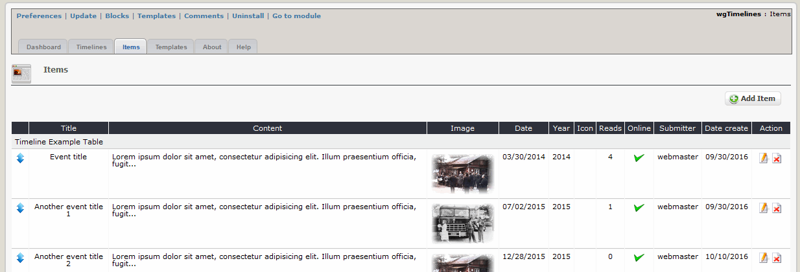
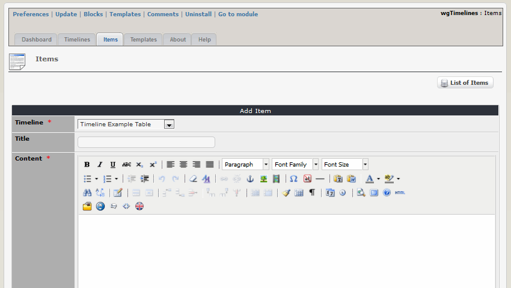

# Items

You can define various members, which you can later combine with one or more teams.

## 2.2.1 List items

On the dashboard tab 'Items' you see a list of the existing items.  You can change the sort order by drag&drop. Whether you use sort by date or weight you have to decide in the settings for the timelines \(see also [Timelines](timelines.md)\).

## 2.2.2 Add/edit items

## Timeline

Please select the timeline, which should be related the item to

## Title

Please enter a title for the item \(optional\)

## Content

Please enter a content for the item

## Image

You can add one image to your item \(optional\)

## Date/Time

Please enter the date for the item \(optional\). Depending on the template and the settings in the template it will be shown or not. The format you have to define in the settings of the timeline \(see also [Timelines](timelines.md)\).

## Year

Please enter the year for the item \(optional\). Depending on the template and the settings in the template it will be shown or not.

## Icon

Please select an icon, which should be used on the badge for the item \(optional\). Depending on the template and the settings in the template it will be shown or not.

## Reads

This shows, how often this item was read already.

## Online

Define, whether the item should be already displayed on user side.

