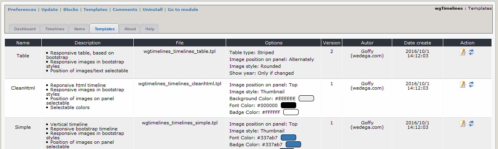
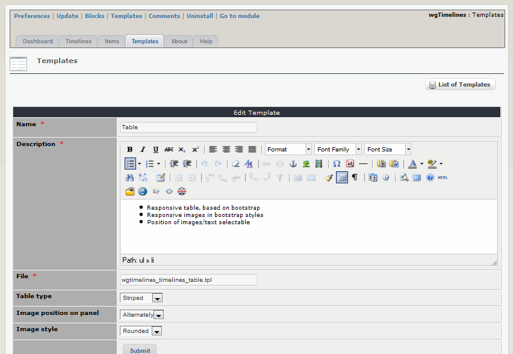

# Templates

You can adopt the existing templates corresponding your wished and use them then for one or more timelines.

## 2.3.1 List templates

On the dashboard tab 'Templates' you see a list of the existing templates with the settings. 

## 2.3.2 Edit templates

Depending on the template you can set various options like image style, color and so one.

## Name

Name of template

## Description

Short description of this template

## Options

Overview about current settings of the options

## Version

Version of your template

## Autor

Autor of the template

## Explanation of symbols:

 This is a new template

 There is a new version of this template available. Click on the symbol to update.

 This template isn't supported anymore by the developer's team. It is recommended to use only supported templates.

 You can reset the template to default values.

