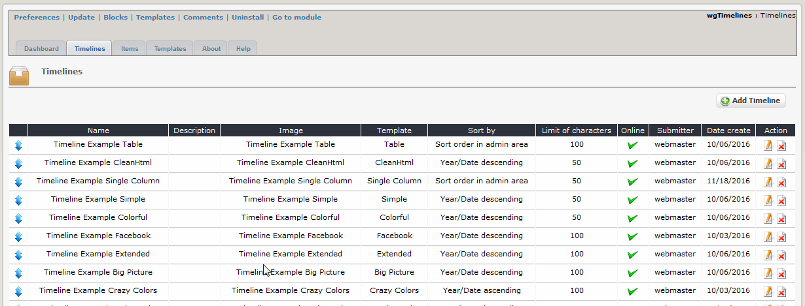
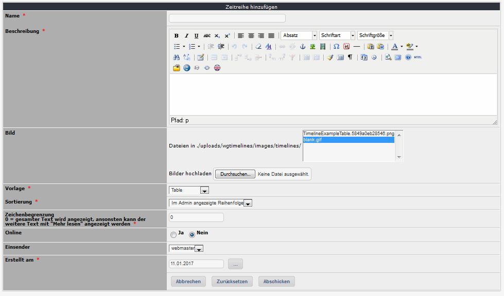

# Timelines

You can define various timelines, select a template for it \(see also [Templates](templates.md)\) and add items \(see also [Items](items.md)\).

## 2.1.1 List timelines

On the dashboard tab 'Timelines' you see a list of the existing timelines.  You can sort the timelines simply by drag&drop.

## 2.1.2 Add/edit timelines

## Name

Please define the name of the timeline

## Description

You can add for each timeline a description. It will be shown depending on your preferences \(see also [preferences](https://github.com/xoops/wgtimelines-tutorial/tree/a0adef0b003de4cd9200069325d8c416a98ff15b/en/book/2preferences.md)\).

## Image

Additonally you can upload a logo/picture for your timeline.

## Template

Please select the prefered template for your timeline

## Sort by

Select the sort order for displaying on user side

## Limit of characters

If the number of characters is limited, on user side will be shown only this number of characters. If exceeding this limit, a "Read more"-link will be shown. 0 means no limit.

## Show date/time

If the template supports the display of date or time of an item you can decide, whether you want to display nothing, only the date or only the time or both.

## Use magnific popup

Please define, whether you want to use jquery magnific-popup for zooming the item images.

## Online

Select, whether the timeline should be shown on userside

