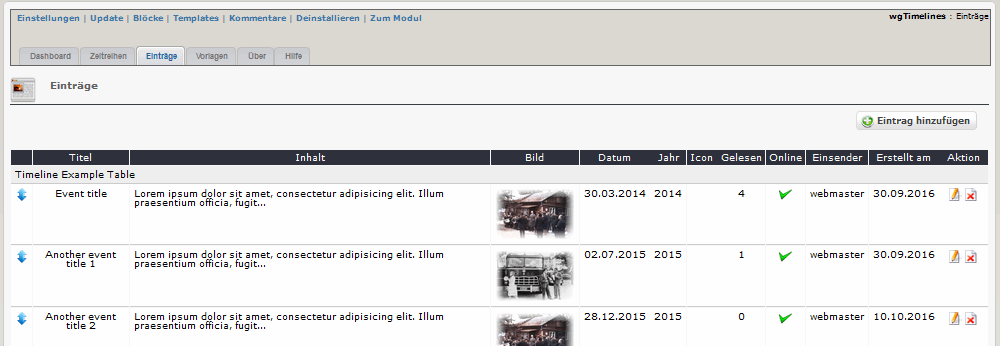
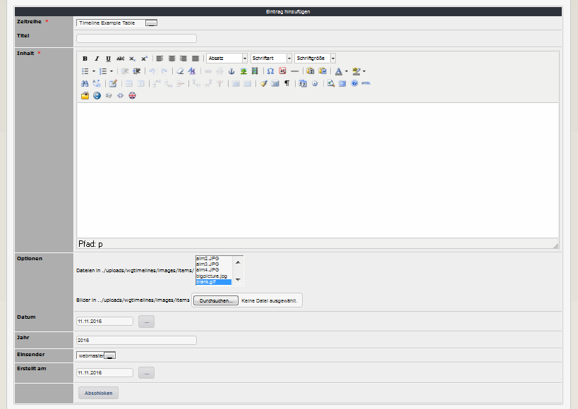

# 2.2 Einträge

Sie können beliebig viele Einträge definieren, die Sie einer bestimmten Zeitreihe zuweisen.

#### 2.2.1 Liste der Einträge
Auf den Registerblatt 'Einträge' sehen Sie eine Auflistung aller bereits existierenden Einträge.

Die Reihung der Einträge kann mit Drag&Drop geändert werden. Ob die Reihung entsprechend der Anzeige oder nach dem Datum erfolgt, muss bei den Einstellungen der Zeitreihe definiert werden (siehe auch [Zeitreihen](2admin_timelines.md)

#### 2.2.2 Einträge hinzufügen/bearbeiten

#### Zeitreihe
Bitte die Zeitreihe wählen, der dieser Eintrag zugeordnet werden

#### Titel
Bitte Titel für Ihren Eintrag wählen (optional)

#### Inhalt
Bitte den Inhalt für Ihren Eintrag eingeben

#### Bild
Sie können Ihrem Eintrag ein Bild hinzufügen (optional)

#### Datum
Bitte das Datum für den Eintrag eingeben (optional). Entsprechend der Vorlage bzw. den Einstellungen bei der jeweiligen Vorlage wird dies angezeigt oder nicht.

#### Jahr
Bitte das Jahr für den Eintrag eingeben (optional). Entsprechend der Vorlage bzw. den Einstellungen bei der jeweiligen Vorlage wird dies angezeigt oder nicht.

#### Icon
Bitte das Icon für den Knotenpunkt des Eintrages auswählen (optional). Entsprechend der Vorlage bzw. den Einstellungen bei der jeweiligen Vorlage wird dies angezeigt oder nicht.

#### Gelesen
Dies zeigt Ihnen, wie oft dieser Eintrag bereits gelesen wurde.

#### Online
Bitte legen Sie fest, ob dieser Eintrag auf der Userseite schon angezeigt werden soll.