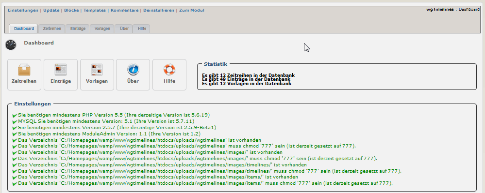

# 2. Administrationbereich

## 2.0.1 Menü
Im oberen Bereich befinden sich 7 Menüpunkte.

|Menüpunkt|	Funktion|
|---|---|
|Einstellungen| Hier können sie die Moduleinstellungen vornehmen |
|Update| Klicken sie hier, wenn sie einige Änderungen am Modul vorgenommen haben, Dateien hochgeladen haben usw. - dadurch wird das Modul neu kompiliert und alle Datenbankeinträge werden erneuert |
|Blöcke| Wenn sie hier klicken, werden sie zur Blockverwaltung weitergeleitet, und es werden die Blöcke des aktuelle Modules vorgefiltert |
|Templates| Hier können sie die Standardtemplates des aktuellen Moduls bearbeiten, verwendet wird dabei der XOOPS Template Manager |
|Kommentare| Dieses Modul unterstützt keine Kommentare, sodass sie zum Xoops Kommentar-Manager weitergeleitet werden |
|Deinstallieren| Sie werden zur Deinstallation des Moduls weitergeleitet |
|Zum Modul| Wenn das Modul auf der Benutzerseite sichtbar ist, werden sie dorthin weitergeleitet |

## 2.0.2 Übersicht
Auf der Hauptübersicht erhalten Sie Informationen über die Funktionen und den Inhalt des Moduls.

## 2.0.3 Funktionalitäten für Administratoren:
* [Zeitreihen](2admin_timelines.md)
* [Einträge](2admin_items.md)
* [Vorlagen](2admin_templates.md)
* [Über](2admin_about.md)
* [Hilfe](2admin_help.md)