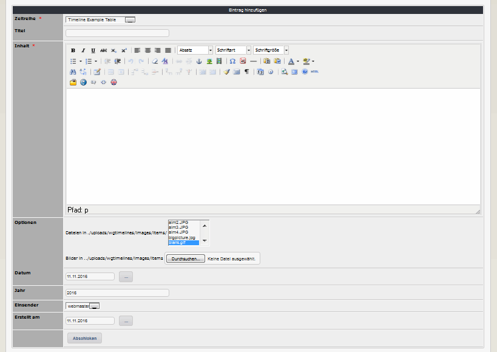

# Einträge

Sie können beliebig viele Einträge definieren, die Sie einer bestimmten Zeitreihe zuweisen.

## 2.2.1 Liste der Einträge

Auf den Registerblatt 'Einträge' sehen Sie eine Auflistung aller bereits existierenden Einträge.  Die Reihung der Einträge kann mit Drag&Drop geändert werden. Ob die Reihung entsprechend der Anzeige oder nach dem Datum erfolgt, muss bei den Einstellungen der Zeitreihe definiert werden \(siehe auch [Zeitreihen](https://github.com/XoopsDocs/wgtimelines-tutorial/tree/6494f8af8a8158a58e318b2c813f93144d5da27e/deutsch/administrationsbereich/2admin_timelines.md)\).

## 2.2.2 Einträge hinzufügen/bearbeiten

## Zeitreihe

Bitte die Zeitreihe wählen, der dieser Eintrag zugeordnet werden

## Titel

Bitte Titel für Ihren Eintrag wählen \(optional\)

## Inhalt

Bitte den Inhalt für Ihren Eintrag eingeben

## Bild

Sie können Ihrem Eintrag ein Bild hinzufügen \(optional\)

## Datum/Uhrzeit

Bitte das Datum bzw. die Uhrzeit für den Eintrag eingeben \(optional\). Entsprechend der Vorlage bzw. den Einstellungen bei der jeweiligen Vorlage wird dies angezeigt oder nicht. Das Format für Datum oder Uhrzeit muss bei den Optionen der Zeitreihe definiert werden \(siehe auch [Zeitreihen](https://github.com/XoopsDocs/wgtimelines-tutorial/tree/6494f8af8a8158a58e318b2c813f93144d5da27e/deutsch/administrationsbereich/2admin_timelines.md)\).

## Jahr

Bitte das Jahr für den Eintrag eingeben \(optional\). Entsprechend der Vorlage bzw. den Einstellungen bei der jeweiligen Vorlage wird dies angezeigt oder nicht.

## Icon

Bitte das Icon für den Knotenpunkt des Eintrages auswählen \(optional\). Entsprechend der Vorlage bzw. den Einstellungen bei der jeweiligen Vorlage wird dies angezeigt oder nicht.

## Gelesen

Dies zeigt Ihnen, wie oft dieser Eintrag bereits gelesen wurde.

## Online

Bitte legen Sie fest, ob dieser Eintrag auf der Userseite schon angezeigt werden soll.

