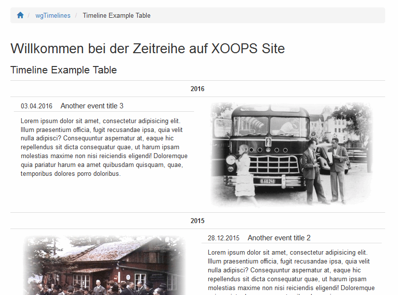
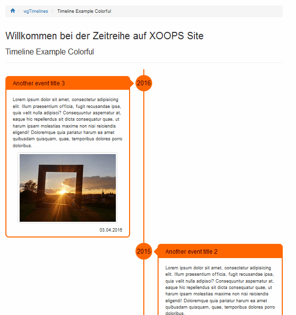
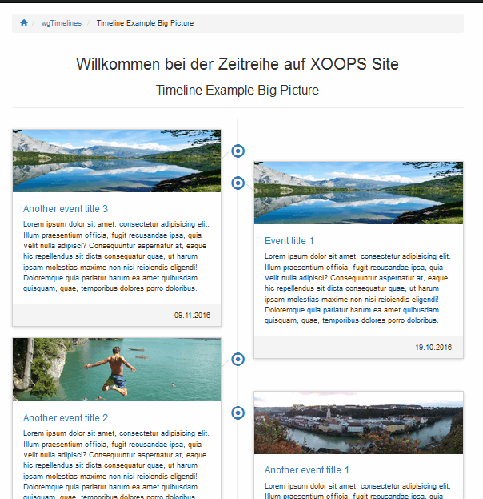
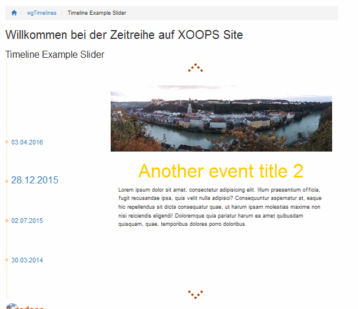

# 5. Die Userseite

Von den Usern sind grundsätzlich keine Aktionen erforderlich.

Je nach den Einstellungen können Sie ihre Zeitreihe(n) in unterschiedlicher Weise anzeigen lassen.

#### 5.1 Mögliche Zeitreihenbeispiele

**Beispiel 1:**

**Beispiel 2:**

**Beispiel 3:**

**Beispiel 4:**

