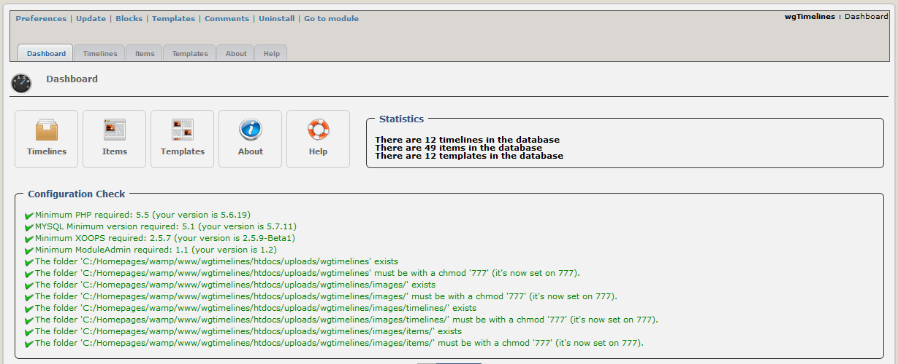

# Einleitung

## Module wgTimelines

#### Version: 1.10

#### für XOOPS 2.5.7/XOOPS 2.5.8

#### für PHP 5.5, 5.6 und 7.0

### Bedienungsanleitung

© 2014 The XOOPS Project \(www.xoops.org\)

### Basisinformation zum Modul

wgTimelines ist ein einfaches Modul zur Präsentation ihres Zeitreihen/Chroniken.

Sie können verschiedene Zeitreihen definieren. Danach können Sie diesen Zeitreihen beliebig viele Einträge hinzufügen.

Fast alle Templates sind voll responsive \(für alle Medien geeignet\).

>  **Achtung:** Dieses Modul arbeitet nur in Kombination mit einem Bootstrap-Theme, oder sie müssen die Bootstrap-Dateien manuell in ihrem Theme einbinden.

  
 _Figure 1: Hauptübersicht des Moduls wgTimelines \(Admin-Bereich\)_

## Inhaltsverzeichnis

* [\(De-\)Installation](https://github.com/XoopsDocs/wgtimelines-tutorial/tree/6928859ef45a97d376e395017106b51fd3776b9c/deutsch/book/1install.md)
* [Administrationsbereich](https://github.com/XoopsDocs/wgtimelines-tutorial/tree/6928859ef45a97d376e395017106b51fd3776b9c/deutsch/book/2administration.md)
* [Einstellungen](https://github.com/XoopsDocs/wgtimelines-tutorial/tree/6928859ef45a97d376e395017106b51fd3776b9c/deutsch/book/3preferences.md)
* [Bedienungshinweise](https://github.com/XoopsDocs/wgtimelines-tutorial/tree/6928859ef45a97d376e395017106b51fd3776b9c/deutsch/book/4operations.md)
* [Benutzerbereich](https://github.com/XoopsDocs/wgtimelines-tutorial/tree/6928859ef45a97d376e395017106b51fd3776b9c/deutsch/book/5userside.md)
* [Blöcke](https://github.com/XoopsDocs/wgtimelines-tutorial/tree/6928859ef45a97d376e395017106b51fd3776b9c/deutsch/book/6blocks.md)
* [Templates](https://github.com/XoopsDocs/wgtimelines-tutorial/tree/6928859ef45a97d376e395017106b51fd3776b9c/deutsch/book/7templates.md)
* [Modul Credits](https://github.com/XoopsDocs/wgtimelines-tutorial/tree/6928859ef45a97d376e395017106b51fd3776b9c/deutsch/book/9credits.md)

### Lizenzbestimmungen:

  
Sofern nicht anders angegeben, fällt dieser Inhalt unter die Lizenzbestimmungen [Creative Commons Attribution-NonCommercial-ShareAlike 4.0 International License](http://creativecommons.org/licenses/by-nc-sa/4.0/).

Alle Derivate sind Teil von XOOPS Project [www.xoops.org](http://www.xoops.org)

#### Bedienungsanleitung Version: 1.4

