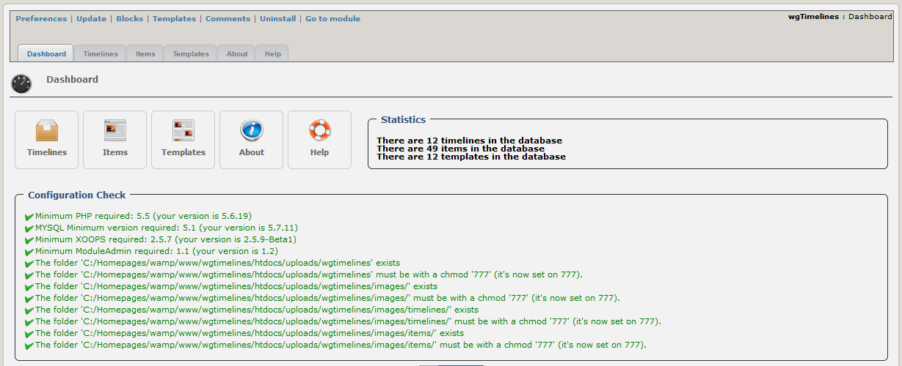

### _XOOPS Documentation Series_

# Module wgTimelines
#### Version: 1.10
#### for XOOPS 2.5.7/XOOPS 2.5.8
#### for PHP 5.5, 5.6 and 7.0

            
## User Manual

© 2014 The XOOPS Project (www.xoops.org)    

## Module Purpose 

This module is for presentation of timelines.

You can defined various timelines and decide between different styles (html, bootstrap timelines, slider,...) for displaying them.

Almost all templates on user side are fully responsive.

> **Attention:**This module works only in combination with a bootstrap theme or you have to include bootstrap files manually to your theme.**

 
*Figure 1: Main view of the wgTimelines Module (Admin side)*

# Table of Content

* [Install/Uninstall](book/1install.md)
* [Administration Menu](book/2administration.md)
* [Preferences](book/3preferences.md)
* [Operating Instructions](book/4operations.md)
* [The User Side](book/5userside.md)
* [Blocks](book/6blocks.md)
* [Templates](book/7templates.md)
* [Module Credits](book/9credits.md)

##License:

 Unless specified, this content is licensed under a <a rel="license" href="http://creativecommons.org/licenses/by-nc-sa/4.0/">Creative Commons Attribution-NonCommercial-ShareAlike 4.0 International License</a>.

All derivative works are to be attributed to XOOPS Project (www.xoops.org)

####Tutorial Version: 1.4