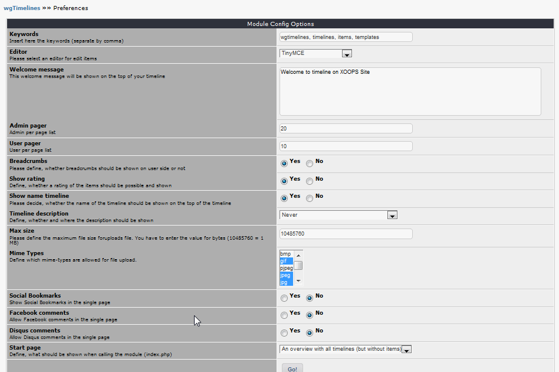

# 3. Preferences

In the module preferences you can set various options for this module: 

## 3.1 Options in detail
#### Keywords
You can add keywords, which are added to the meta tags. Seperate the keywords by comma.

#### Editor
You can decide, which editor should be used for editing on admin sides.
Xoops offers by default 3 editors:
###### 1) onlyText
This editor can be used for saving pure text
###### 2) DHTML with xCode
An Editor with various Xoops-Tags
###### 3) TinyMCE
Extended texteditor with a lot of options for formatting, lists, and so on.
The text will be save as HTML-Code in your database.

Attention: if you display text, which is created with TinyMCE, diplay later with e.g. the DHTML-Editor, you will see all the Html-Tags. Please use in this case again TinyMCE or remove all HTML-Tags.

#### Welcome message
This welcome message will be shown on the top of your timeline

#### Admin pager
You can define the number of items for lists in admin area.

#### User pager
You can define the number of items for lists in user area.

#### Show breadcrumbs-navigation
Please decide, whether a breadcrumbs-navigation should be shown on user sides.

#### Show rating
Define, whether a rating of the items should be possible and shown

#### Groups with permission to rate
Please define the groups, which have the permission to rate a timeline item

#### Show name timeline
Please decide, whether the name of the timeline should be shown on the top of the timeline

#### Timeline description
Define, whether and where the description should be shown

#### Max size
Please define the maximum file size foruploads file. You have to enter the value for bytes (10485760 = 1 MB).

#### Mime-Types
Define which mime-types are allowed for file upload.

#### Social Bookmarks
Show Social Bookmarks in the single page

#### Facebook comments
Allow Facebook comments in the single page

#### Disqus comments
Allow Disqus comments in the single page

#### Start page
Define, what should be shown when calling the module (index.php)
