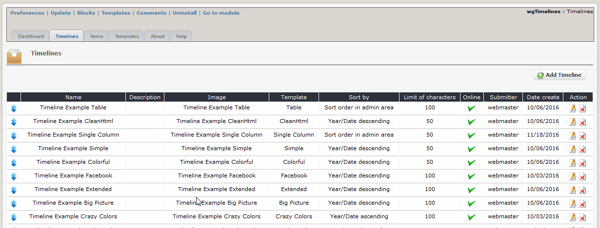

# Administration Menu

You can define various timelines, select a template for it \(see also [Templates](https://github.com/XoopsDocs/wgtimelines-tutorial/tree/6494f8af8a8158a58e318b2c813f93144d5da27e/english/administration-menu/2admin_templates.md)\) and add items \(see also [Items](https://github.com/XoopsDocs/wgtimelines-tutorial/tree/6494f8af8a8158a58e318b2c813f93144d5da27e/english/administration-menu/2admin_items.md)\).

## 2.1.1 List timelines

On the dashboard tab 'Timelines' you see a list of the existing timelines.  You can sort the timelines simply by drag&drop.

## 2.1.2 Add/edit timelines

## Name

Please define the name of the timeline

## Description

You can add for each timeline a description. It will be shown depending on your preferences \(see also [preferences](https://github.com/XoopsDocs/wgtimelines-tutorial/tree/6494f8af8a8158a58e318b2c813f93144d5da27e/english/administration-menu/2preferences.md)\).

## Image

Additonally you can upload a logo/picture for your timeline.

## Template

Please select the prefered template for your timeline

## Sort by

Select the sort order for displaying on user side

## Limit of characters

If the number of characters is limited, on user side will be shown only this number of characters. If exceeding this limit, a "Read more"-link will be shown. 0 means no limit.

## Online

Select, whether the timeline should be shown on userside

