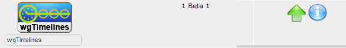
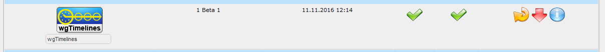

# 1. Install/Uninstall

No special measures necessary, follow the standard installation process – extract the module folder into the /modules directory. Install the module through Admin -> Modules -> Install Modules (see below). 
Detailed instructions on installing modules are available in the [XOOPS Operations Manual](http://goo.gl/adT2i).

#### 1.1 Install
- Extract folder 'wgtimelines' in your module directory
- Log in as admin and goto admin area
- Install the module through Admin -> Modules -> Install Modules
 
*Figure 2 Module administration and install*
- configure the module
- the next steps are setting the rights under System --> Groups.

#### 1.2 Uninstall
To uninstall the module, just click on the red arrow
 
*Figure 3 The Module Administration and un-install*