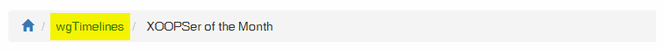

# Operating Instructions

## Create a timeline

For presenting a timeline do following:

* [Create a timeline](https://github.com/XoopsDocs/wgtimelines-tutorial/tree/46e3b0fae5226f20ec9e429a3dddd81c511f4800/english/2admin_timelines.md)
* [Add your items for each timeline](https://github.com/XoopsDocs/wgtimelines-tutorial/tree/46e3b0fae5226f20ec9e429a3dddd81c511f4800/english/2admin_items.md)
* [Adopt, if you want, the template you want use](https://github.com/XoopsDocs/wgtimelines-tutorial/tree/46e3b0fae5226f20ec9e429a3dddd81c511f4800/english/2admin_templates.md)
* [Set timeline online](https://github.com/XoopsDocs/wgtimelines-tutorial/tree/46e3b0fae5226f20ec9e429a3dddd81c511f4800/english/2admin_timelines.md)

## Breadcrumb-Menu

The breadcrumb menu is created by Xoops Core: `$xoBreadcrumbs[] = array('title' => _MA_WGTIMELINES_TITLE, 'link' => WGTIMELINES_URL . '/');` If you want to change in this example "wgTimelines", you have to change language var \_MA\_WGTIMELINES\_TITLE

