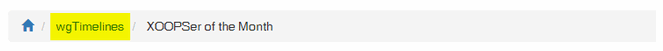

# Operating Instructions

## Create a timeline

For presenting a timeline do following:

* [Create a timeline](administration-menu/timelines.md)
* [Add your items for each timeline](administration-menu/items.md)
* [Adopt, if you want, the template you want use](administration-menu/templates.md)
* [Set timeline online](administration-menu/timelines.md)

## Breadcrumb-Menu

The breadcrumb menu is created by Xoops Core: `$xoBreadcrumbs[] = array('title' => _MA_WGTIMELINES_TITLE, 'link' => WGTIMELINES_URL . '/');` If you want to change in this example "wgTimelines", you have to change language var \_MA\_WGTIMELINES\_TITLE

