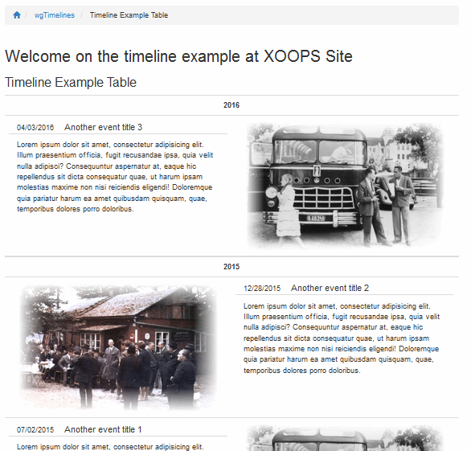
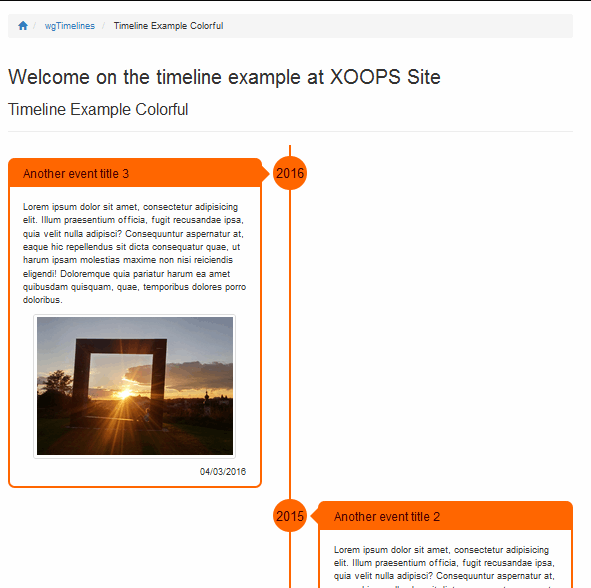
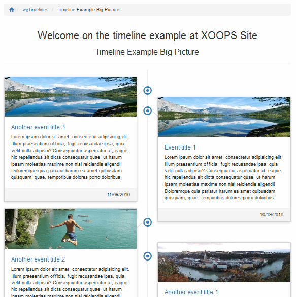

# The User Side

For the users there is no action required on user side.

Depending on your settings/preferences you can present your timelines in various ways.

## 5.1 Possible presentation styles

**Example 1:**

**Example 2:**

**Example 3:**

**Example 4:**

